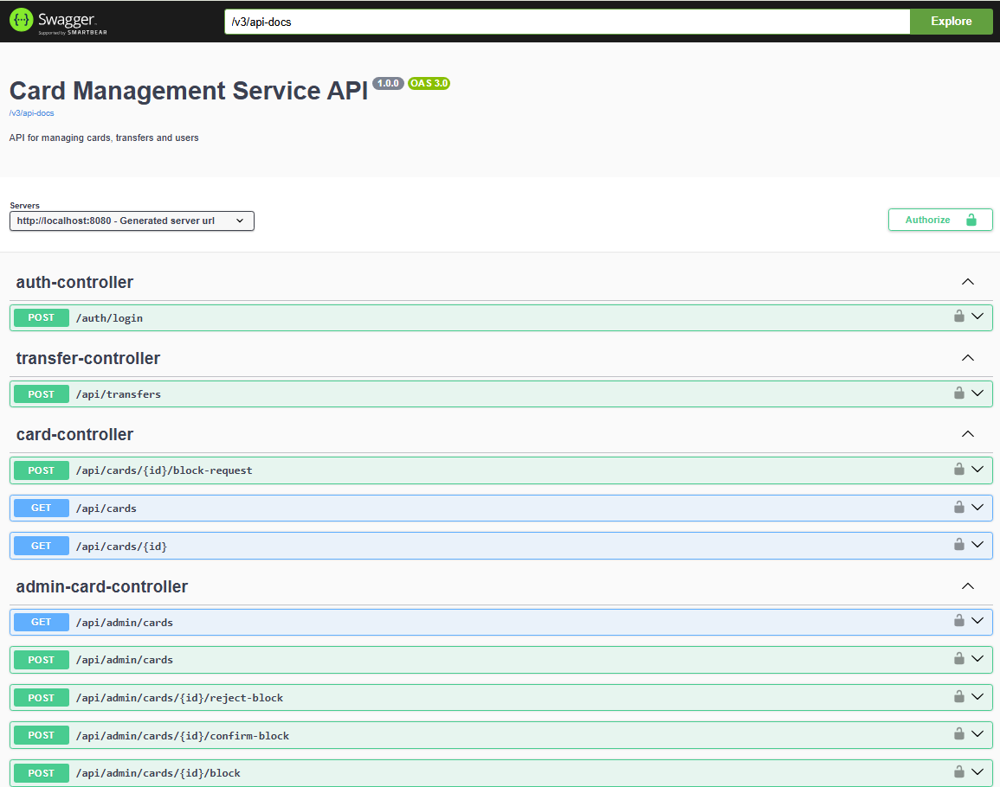
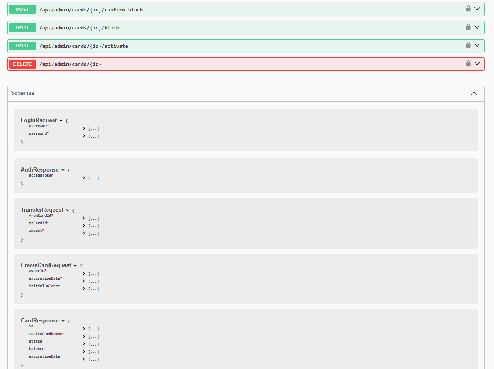
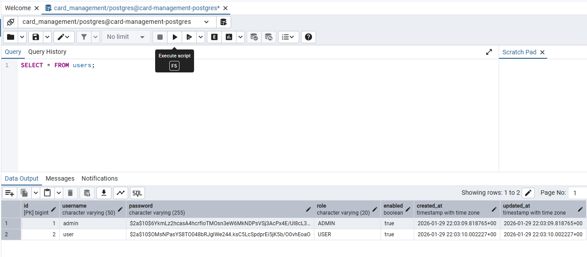
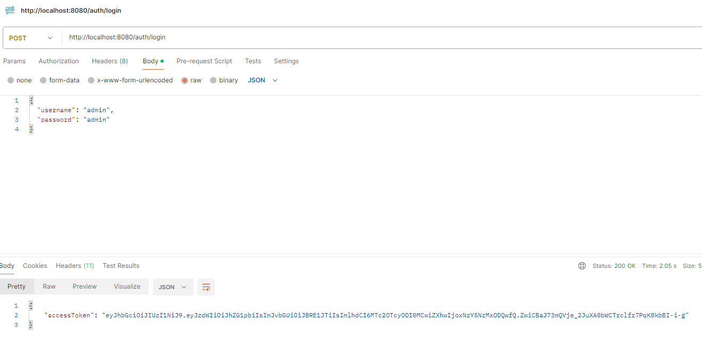

API service for managing payment cards, transfers, and users.

## Description

Card Management Service is a microservice for managing payment cards. It provides an API for administrators and users with features for creating, blocking, activating, deleting cards and transferring funds between them.

---

## Features

### Administrator

- Creating, blocking, and activating cards
- Deleting cards
- User management (creation, blocking, activation)
- Viewing all cards in the system
- Viewing transfer history

### User

- Viewing their own cards with search and pagination
- Requesting card blocking
- Transferring funds between their own cards
- Viewing card balance
- Viewing operation history

---

## Quick Start

### Requirements

- Java 21 or higher
- Maven 3.8 or higher
- PostgreSQL 15 or higher
- Docker 
---

## Installation

### Docker Compose Setup

#### Step 1: Clone the repository

```bash
git clone https://github.com/irinakomarchenko/card-management-service.git
cd card-management-service
```

#### Step 2: Create .env file
Create a `.env` file in the root directory with the following content:

```env
POSTGRES_DB=yourdatabasename
POSTGRES_USER=yourusername
 POSTGRES_PASSWORD=yourpassword
APP_ENCRYPTION_SECRET_KEY=your-encryption-secret-key
JWT_SECRET=your-jwt-secret-key
```
#### Step 3: Start services with Docker Compose

```bash
docker compose up --build
```
This command will build and start the PostgreSQL database and the Card Management Service.
#### Step 4: Access the application
Once the services are up and running, you can access the Card Management Service API at `http://localhost:8080`.
  Swagger UI: http://localhost:8080/swagger-ui.html

###   An example of the application's operation




